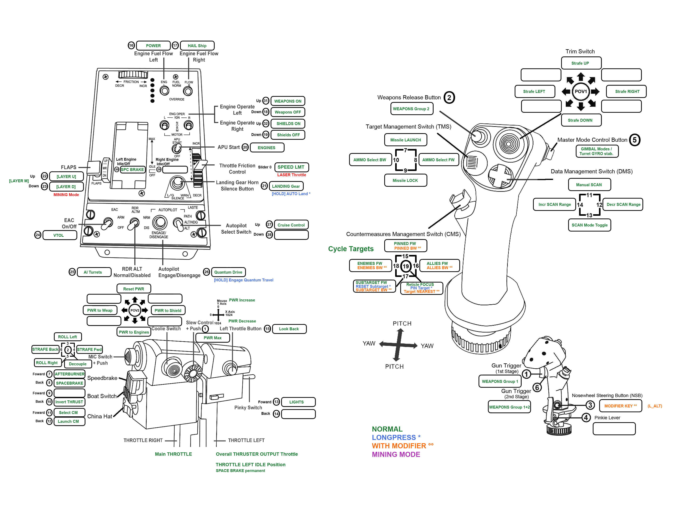

# TM Warthog config script for StarCitizen v3.5.0

A simple Warthog HOTAS setup to match the current SC control schema.
The goal is to use as much of the SC default keybindings to minimize the controllers setup ordeal between releases.

## Prerequisites
 * You need to have the Thrustmaster T.A.R.G.E.T. software version v3.0.18.328 installed

## How to run
 * Download latest [release .zip](https://github.com/aboutflash/StarCitizen-WarthogScript/releases/tag/0.1.3) and unzip the contents of it. <br>Alternatively check out or download the files under ```./script```. All of it.<br>
 See what's new in the [Release notes](script/release_notes.txt).
 * Point your T.A.R.G.E.T. software to run the script directly w/o loading the GUI.<br>
 ```"C:\Program Files (x86)\Thrustmaster\TARGET\x64\TARGETGUI.exe" -r E:\StarCitizen-WarthogScript\script\StarCitizen_3.5.x_combined.tmc```<br>
 Where the latter path is obviously the location where you've copied the scripts to.
 * Check out or download the keybindings file under ```./sc-settings/mappings```
 * Import the keybindings in-game:
    * Keyboard -> Keyboard
    * Mouse -> Mouse
    * Joystick (1) -> Joystick (1) // virtual Warthog HOTAS
    * Joystick (2) -> Joystick (2) // optional Rudder Pedals - if you have some

 * Apply a few [manual settings](sc-settings/ManualSettings.md) in-game.

## Usage advice
Since StarCitizen is not yet able to provide status via an API T.A.R.G.E.T. is not able to detect in which state your ship is. This is especially difficult since StarCitizen keybindings still rely on toggle behaviour. This is cool for Mouse/Keyboard players but brings problems with input devices with flip-switches.

To tackle this problem we have to make some assumptions on the ship's state in order to have fun using the HOTAS. Basically this assumption is, that the ship you are entering is spawned without any systems on.
When you as a pilot enter your pilot seat you should take a brief pre-flight check to bring your HOTAS in the right configuration. 
 1. Flip all switches to their neutral/default state!
 1. Turn on the `POWER` switch. - Wait for the ship AI confirmation message
 1. Then turn on `ENGINES`

## TrackIR
Looking around in your cockpit is great with TrackIR! But it's absolutely impossible to aim down a gun's sight in FPS mode. Sometimes it's also easier to handle kiosk menus without a moving head.
To switch between look-around mode and FPS aim-down-sight mode one switch on the HOTAS is dedicated to flip between those two modes.
In order to work with your TrackIR configuration you should bind the **PAUSE** function to => `[DEL]` and the **Re-Center** function to => `[HOME]`.

## Action Mapping / Layout
Here's an overview of the currently mapped functions to the HOTAS buttons and axis.


Here are also some other variants. The dark ones are perfekt as a reference in typical gaming environments. You can also use them as screen background.<br>
* [Functions Layout](resources/warthog_layout.png) (original size 3524 x 2624px, light)
* [16:9 variant (dark)](resources/Wallpaper_16by9.png) (1920 x 1080px - dark)
* [16:10 variant (dark)](resources/Wallpaper_16by10.png) (2560 x 1600px - dark)
 
## Trouble shooting
In this manual I assume, that the Warthog HOTAS is the only controller you have attached to your PC (besides Rudder Pedals, if you have).
If you have trouble loading the keybindings into StarCitizen it may be because the game has registered another Joystick type controller to position 1 of your Joystick slots (1-4).

You have 2 options to solve this issue.
 1. Re-sort your controllers in-game.
     * Open your in-game console: `^`
     * enter: `i_DumpDeviceInformation`.<br>
     *See to what internal slots your devices are assigned to.*
     * resort joysticks, by example: `pp_resortdevices joystick 2 1` <br>
     *This moves stick **2** to position **1** obviously.<br>
     You have to **use the correct numbers** matching your machines setup!*
 1. Import the HOTAS keybindings to a different slot.<br>
 *This requires also to adjust the deadzones for that slot! See [manual settings](sc-settings/ManualSettings.md))*

 If you happen to use TeamSpeak 3 on Windows 10 and find your T.A.R.G.E.T. software to hang or crash once you've loaded Teamspeak, then navigate to ```C:\Program Files (x86)\Thrustmaster\TARGET\x64\DeviceManagementApp.exe``` and rename or delete it.

## Further reading
1. CIG documentation on keybinding management ['Create, export and import custom profiles'](https://support.robertsspaceindustries.com/hc/en-us/articles/360000183328-Create-export-and-import-custom-profiles)
